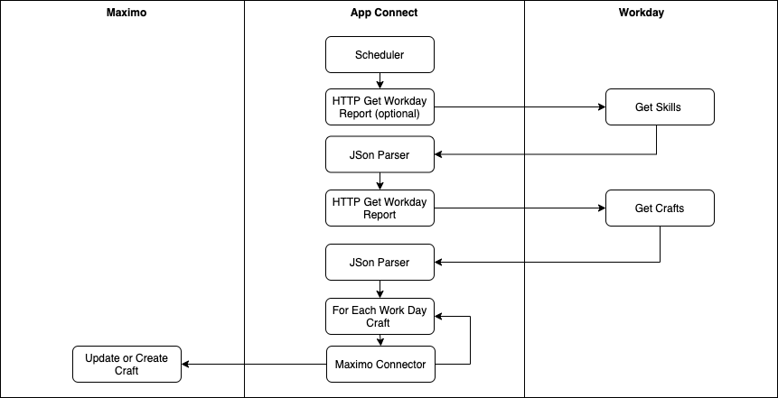
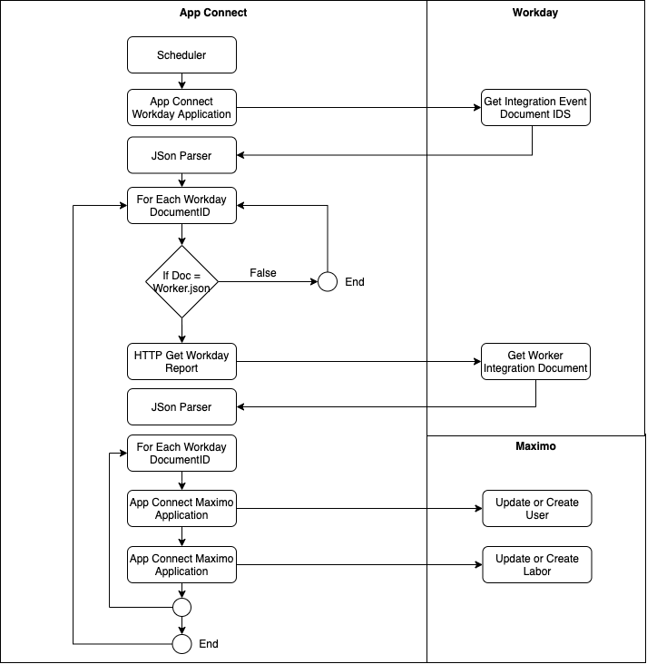

# maximo-workday HR Integration Flow

## Introduction

This solution pattern applies to Maximo Enterprise Asset Management and Workday HR Software Services.   Maximo is one of 
the market leading Enterprise Asset Management software services.   Workday is a leading HR resource management service.  
The employees managed in Workday are the technicians and laborers that are the resources that you likely would assign to 
work on service requests or work orders in Maximo.  It is important that you use the lastest and most accurate
information from Workday when assigning labor to work orders in Maximo.   Manually keeping these Workday Employees in 
synchronization with users and laborers in Maximo is too time consuming.  This deployment pattern shows how you can use 
an App Connect SaaS message flow to do the initial setup of Crafts in Maximo using Workday Skills.   It also shows how you 
can schedule creating and updating Labor with Crafts and user information imported from Workday.
 
 
When you have completed this code pattern, you will understand how to:

* Use and maintain operational HR data from Workday in Maximo EAM.
* Query Workday hr data to fetch and map it to Maximo Crafts, Users and Laborers that can be assigned to a Maximo Work Order.
* Integrate data from the Workday with Maximo EAM using IBM App Connect SaaS.

**Pre-requisites**
*  Collect the host connection details including the URL, user id and passwords for connecting to Maximo, Workday and App Connect. 
*  Ensure you have your Maximo Organization name.
*  Ensure your Workday supoprt team have configured the access controls, integration events and reports indicated in the Workday Setup.

## Architecture

**Setup Skills Message Flow Logical Diagram**

  


**Update Labor Message Flow Logical Diagram**

  


## Flow

1. The PI System collects operational asset time series sensor data  as PI points via a PI Interface which gets persisted in a PI archive.
2. A scheduled cron script fetches new point data from the archive or data historian using PI Web APIs, filters and formats the data and sends it to App Connect via a HTTP POST.
3. In App Connect, point data is mapped to data in the entity type and dimensions tables that was created to store point data and point meta-data.
4. Point data captured in these tables for each site and asset can be viewed in Maximo Asset Monitor and dashboards created for a consolidated view.  

## Included Components and Technologies

* [IBM Maximo Enterprise Asset Management (EAM)](https://www.ibm.com/support/knowledgecenter/en/SSBLW8/com.ibm.mamc.doc/overview/c_prod_overview.html) "Is an asset management life cycle and workflow process management system. With Maximo EAM SaaS, you can manage your asset operations and business processes."
* [IBM App Connect SaaS](https://www.ibm.com/us-en/cloud/app-connect) "instantly connect applications, data, heritage systems and modern technologies through a variety of integration styles. From traditional service-oriented architectures to modern, agile and event-driven ones, App Connect can virtualize access to data wherever it lives, for exposure as APIs."
* [Workday HR](https://www.workday.com/en-gb/products/human-capital-management/human-resource-management.html) Human resource management for the changing world of work.

## Steps

1. [Clone the repo](#1-clone-the-repo).
2. [Setup Workday](#2-setup-workday).
3. [Setup Maximo EAM Software ](#2-setup-the-maximo-eam).
4. [Setup App Connect](#2-setup-app-connect).
5. [Import, configure and run the App Connect message flows](#7-update-the-provided-app-connect-application-configuration-to-publish-data-to-monitor)
6. [Test Run the Flows in App Connect](#8-send-oil-well-down-time-data-from-the-pi-data-historian-to-maximo-asset-monitor).
7. [VMap Additional Attributes](#9-view-oil-well-down-time-data-in-maximo-asset-monitor).

### 1. Clone the repo

Clone the `maximo-workday-hr` repository to the destination of your choice.  
In a terminal window, run:

```
git clone https://github.com/IBM/maximo-wworkday-hr.git
```

### 2. Setup Workday
Read the instructions in the [Workday Setup document](workday_setup.md) 

### 3. Setup Maximo EAM
Read the instructions in the [Maximo Setup document](maximo_setup.md) 

### 4. Setup App Connect
Read the instructions in the [App Connect Setup document](app_connect_setup.md) 

### 5. Import, configure and run the App Connect message flows
* In App Connect, import the [setup flow](maximo_workday_intial_setup_crafts.yaml) and the [integration events flow](maximo_workday_get_integration_events.yaml) using these [instructions](https://www.ibm.com/support/knowledgecenter/SSTTDS_11.0.0/com.ibm.ace.icp.doc/certc_exportingimportingapiflows.htm)   
* Open each flow and update the Maximo and Workday Connector node accounts wth your own [accounts](https://www.ibm.com/support/knowledgecenter/SSTTDS_11.0.0/com.ibm.ace.icp.doc/certc_connectingtoaccounts.html). 

### 6. Test Run the Flows in App Connect
* In App Connect run the setup crafts flow you imported in the previous step. Stop the flow after 10 minutes.  
* Check that the crafts have been added in Maximo.
* In App Connect Run the get integrations event flow you imported in the previous step. The flow will run every 5 minutes.  Change the flow scheduler to once per day if you only expect your employee data to change once per day. 
* Check that the users and labors have been added in Maximo.
* In Maximo create a new Maximo Worker Order and assign a labor that was replicated from Workday.
* Use the [App Connect logs](https://developer.ibm.com/integration/docs/app-connect/troubleshooting/viewing-app-connect-logs-in-the-log-viewer/) to trouble shoot App Connect Message Flows you imported and configured.

### 7. Extend the Code Pattern by Mapping Additional Attributes
* To share attributes across Maximo and Workday map objects shown in the architecture steps
* Add any other mappings for attributes your organization needs in the App Connect message flow. 
* Be careful to not exceed the maximum character length allowed for an Maximo object attribute and map the data types for number, string, array or object.
* Initially map the minium requires attributes for a given flow.
  
## References
See the [references document](references.md) for the list of references used to create this Code Pattern.

## License

This code pattern is licensed under the Apache License, Version 2. Separate third-party code objects invoked within this code pattern are licensed by their respective providers pursuant to their own separate licenses. Contributions are subject to the [Developer Certificate of Origin, Version 1.1](https://developercertificate.org/) and the [Apache License, Version 2](https://www.apache.org/licenses/LICENSE-2.0.txt).

[Apache License FAQ](https://www.apache.org/foundation/license-faq.html#WhatDoesItMEAN)