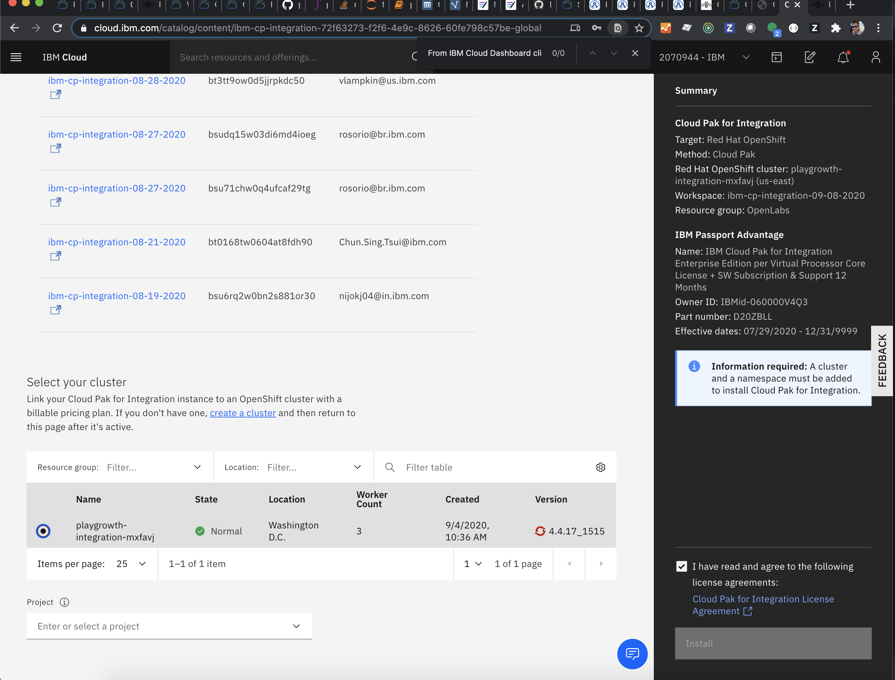
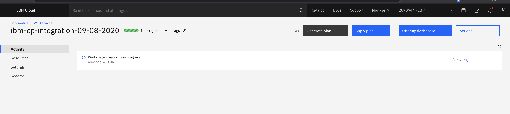

Create an IBM App Connect service in IBM Cloud
  - Create an [IBM Trial Account](https://cloud.ibm.com/registration/premium?lnk=ukCloudExp&lnk=STW_UK_BUHP_L1_BTN&psrc=NONE&pexp=DEF&lnk2=trial_Cloud) 
  - From IBM Cloud Dashboard click `create resource` button
  - Select `App Connect` tile in the catalog
  - Select the free `Lite Plan`
  - Make note of the `service name` and `region`
  - Click `Create` button to create an App Connect Service to create message flows. 
 
 Optionally Get App Connect by Installing Cloud Pak for Integration into an OpenShift Cluster
  - Provision OpenShift Cluster.
  - Get Cloud Pack for Integration entitlement from Passport Advantage..
  - From IBM Cloud Dashboard click `Catalog`
  - Search for CP4I in the   and click on the Cloud P
  - Select your Cluster
  - Enter a unique project name like "workday-maximo"
  - Enter a tag name like "workday-maximo"
  - Create a parameter value for csDefaultAdminPasword at least 32 characters in length
  - Accept license terms checkbox
  - Click `Install` button to    into your cluster  &nbsp;  
  - A new browser tab will open showing `in progress`   into your cluster  &nbsp;  
  - Click `show logs` button to see the details of the installation progress
  
Launch the App Connect Dashboard
  - Launch the App Connect Service Dashboard from the IBM Cloud `navigation menu`,  choose `resource` to see the list of services.
  - Expand `Cloud Foundry Services`,  click on the App Connect service name you created in the previous step.
  - Click on the name of the service
  - Click on `Launch App Connect` button to opn App Connect dashboard in a new window

Create an App Connect API for Workday
  - Click on `Catalog` menu on the App Connect Dashboard
  - Click on `APIs`tab
  - Click on `Add your API or web service now` link to add the Workday API WSDL  &nbsp;  
  
Create an Event Driven Flow to Get Workers
  - Launch the App Connect Service Dashboard from the IBM Cloud `navigation menu`,  choose `resource` to see the list of services.
  - Expand `Cloud Foundry Services`,  click on the App Connect service name you created in the previous step.

test