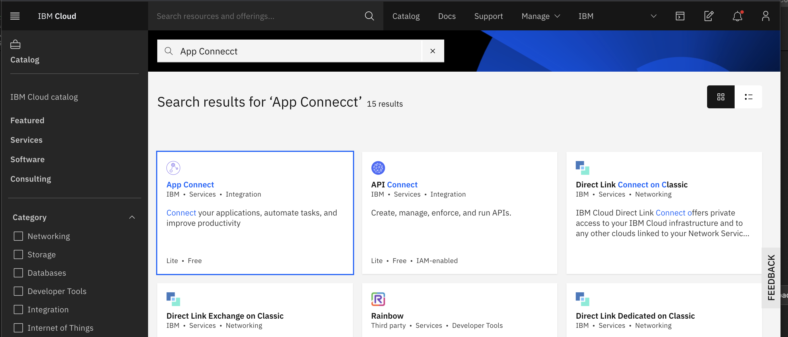
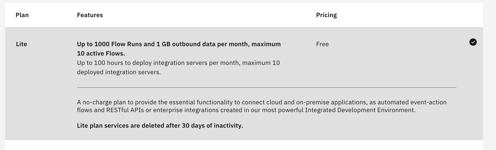
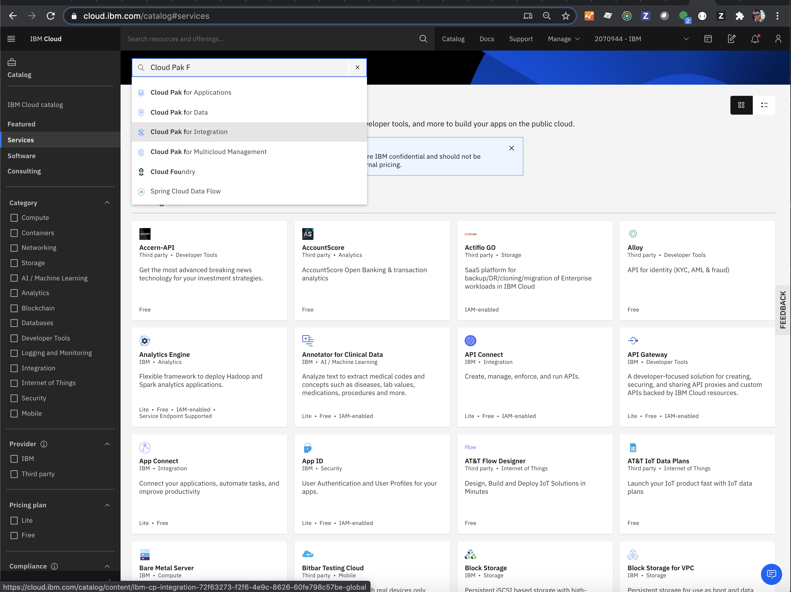
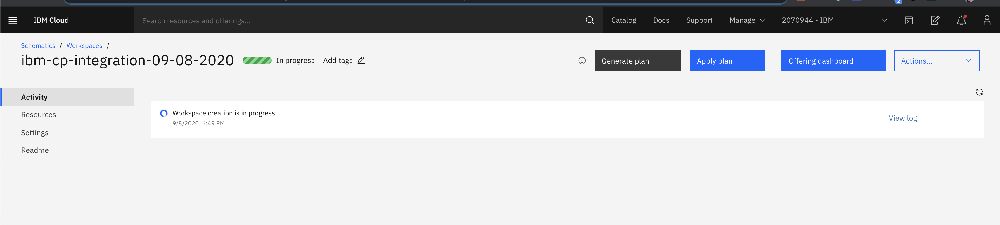
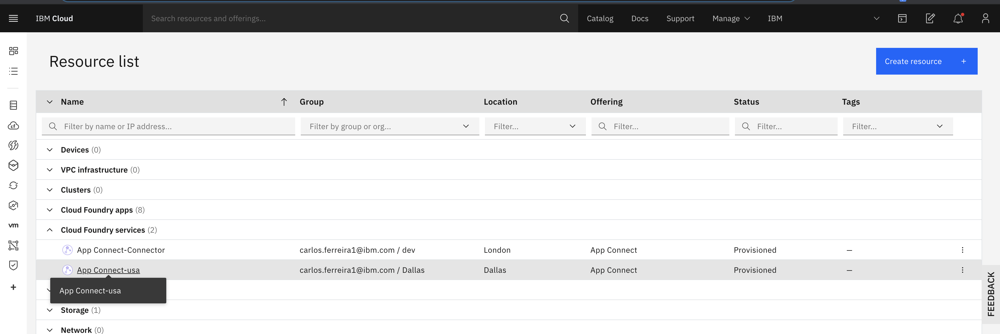
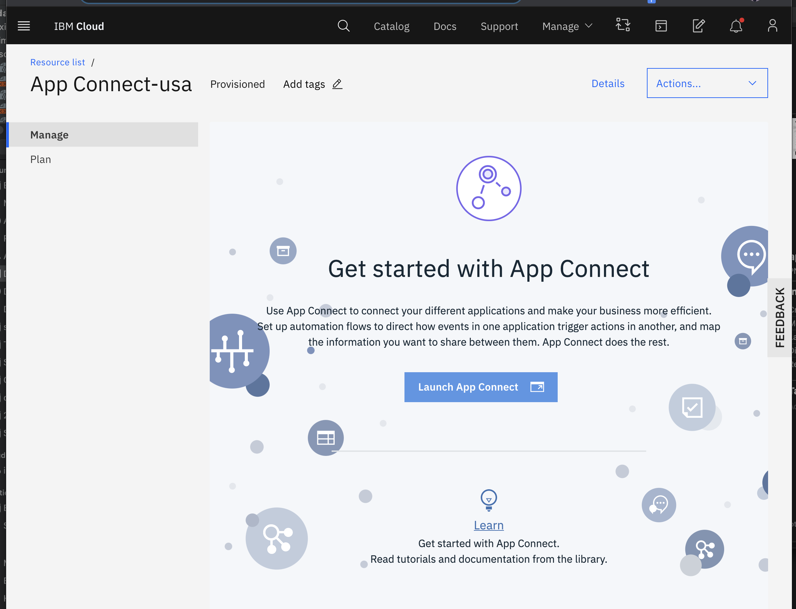
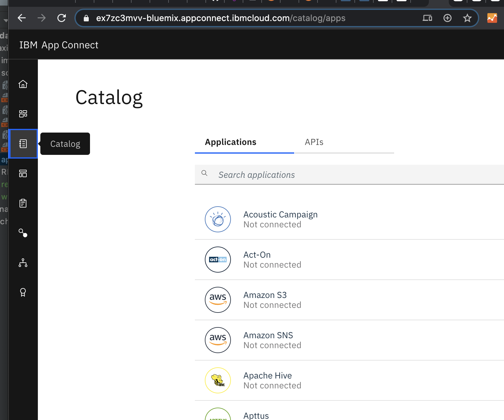
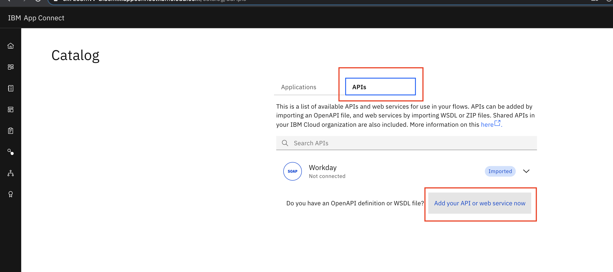
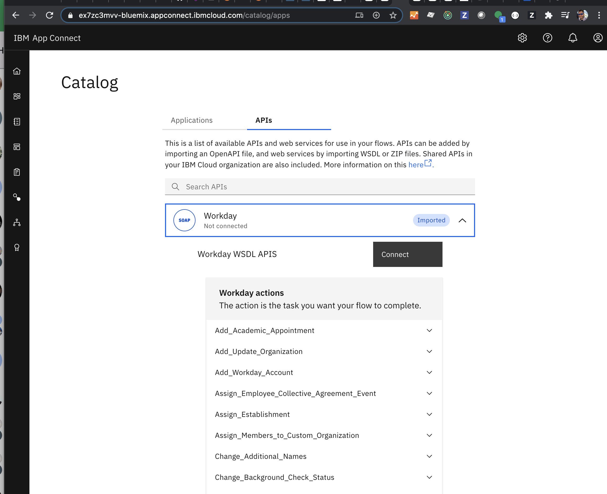
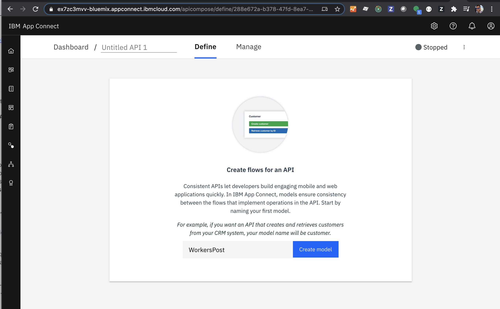

## Create an IBM App Connect service in IBM Cloud
  - Create an [IBM Trial Account](https://cloud.ibm.com/registration/premium?lnk=ukCloudExp&lnk=STW_UK_BUHP_L1_BTN&psrc=NONE&pexp=DEF&lnk2=trial_Cloud) 
  - From IBM Cloud Dashboard click `create resource` button 
  - Select `App Connect` tile in the catalog    
  - Select the free `Lite Plan` 
  - Make note of the `service name` and `region`
  - Click `Create` button to create an App Connect Service to create message flows. 
 
 ## Optionally Get App Connect by Installing Cloud Pak for Integration
  - Get App Connect by installing Cloud Pak for Integration for OpenShift. Provision OpenShift Cluster from IBM Cloud. 
  - Get Cloud Pack for Integration entitlement from Passport Advantage.
  - Install using [instructions document](https://pages.github.ibm.com/demox/cloudpak-integration/cp4i-on-roks/)
  - From IBM Cloud Dashboard click `Catalog`
  - Search for CP4I in the  
  - Select your Cluster
  - Enter a unique project name like "workday-maximo"
  - Enter a tag name like "workday-maximo"
  - Create a parameter value for csDefaultAdminPasword at least 32 characters in length
  - Accept license terms checkbox
  - Click `Install` button to    to your cluster  &nbsp; 
  - A new browser tab will open showing  apply the `in progress`     to your cluster  &nbsp;  
  - Click `show logs` button to see the details of the installation progress
  - The Worksspace is created
  - Click "Apply Plan"  
  - Click "Offering Dashboard"  Accept token exceptions
  - Select Red Hat authentication mechanism for   which will then open the 
  
## Launch the App Connect Dashboard Using IBM Cloud
  - Launch the App Connect Service Dashboard from the IBM Cloud `navigation menu`,  choose `resource` to see the list of services.
  - Expand `Cloud Foundry Services`,  click on the App Connect service name you created in the previous step.  
  - Click on the name of the service
  - Click on `Launch App Connect` button to opn App Connect dashboard in a new tab window   into your cluster  &nbsp;  

## Create an App Connect API for Workday (May not be necessary given using Workday Post method)
  - Click on `Catalog` menu on the App Connect Dashboard  &nbsp; 
  - Click on `APIs`tab  &nbsp; 
  - Click on `Add your API or web service now` link to add the Workday API WSDL  
  - You should now be able to expand the Workday API and see available methods.   &nbsp;  

## Create an Event Driven Flow to Get Workers from Workday  (May not be necessary given using Workday Post method)
  - Launch the App Connect Service Dashboard from the IBM Cloud `navigation menu`,  choose `resource` to see the list of services.
  - Expand `Cloud Foundry Services`,  click on the App Connect service name you created in the previous step.

## Creating a flow for an API

Creating a flow for an API for Workday to post workers into an App Connect HTTP Post Endpoint.  If you want a developer to be able to create an application that uses the data in your cloud-based applications, you can provide an API. To create flows for an API, complete the following steps.

  - Launch the App Connect Service Dashboard from the IBM Cloud `navigation menu`,  choose `resource` to see the list of services.
  - Expand `Cloud Foundry Services`,  click on the App Connect service name you created in the previous step.
  - On the IBM® App Connect dashboard, click New > Flows for an API.
  - Enter a name for your API.    &nbsp;  
  - Enter a name for your model that reflects the type of object that your API works with, then click Create model.
  - Add the properties that are required to define the structure of your object that your API works with. For example, if your API creates or retrieves a customer, you might add properties that are called Customer_ID, First_Name, Last_Name, and Email_Address. You can either type in the name of a property, or click Select properties from applications to choose properties from one or more of the applications that you’re connected to.
  - Click Operations to define how the API interacts with the object, and add the operations that you need.
  - For each operation, click Implement flow to create a flow that defines how each operation works.
  - Add one or more target applications to the flow, between the request and response. If you want your flow to do different things for different conditions, you can also add some conditional logic (see Adding conditional logic to a flow External link icon).
  - Click the Response in the flow to define the response that is returned when the operation is completed. Map the available fields from your target application.
  - Click Done to return to your model.
  - When all your models and operations are defined, start the API by selecting Start API from the menu.
  - The flows for your API are ready. On the IBM® App Connect dashboard, flows for APIs are identified by the API icon. You can start and stop them in the same way as any other flow. You can open an API while it’s running, but you have to stop it before you can edit it.

For more information, see Creating flows for an API External [link](https://www.ibm.com/support/knowledgecenter/en/SS6KM6/com.ibm.appconnect.dev.doc/tutorials/creating-flows-api.html)

To find out how to test your API, see Testing an API flow External link icon.  
  
  
  
## Create an Event Driven Flow for Publishing to Maximo

App Connect Maximo Connector includes the following events that can trigger a flow.  &nbsp; 

Get App Connect by Installing Cloud Pak for Integration