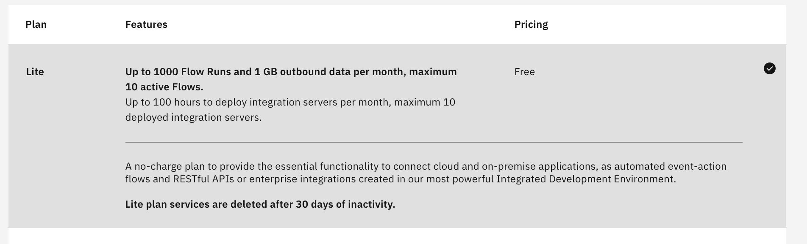

# Steps

## 1. Create an IBM App Connect service in IBM Cloud
  - Create an [IBM Trial Account](https://cloud.ibm.com/registration/premium?lnk=ukCloudExp&lnk=STW_UK_BUHP_L1_BTN&psrc=NONE&pexp=DEF&lnk2=trial_Cloud) 
  - From IBM Cloud Dashboard click `create resource` button 
  - Select `App Connect` tile in the catalog    
  - Select the free `Lite Plan` 
  - Make note of the `service name` and `region`
  - Click `Create` button to create an App Connect Service to create message flows. 
  
##  2.  Launch App Connect Dashboard Using IBM Cloud
  - Launch the App Connect Service Dashboard from the IBM Cloud `navigation menu`,  choose `resource` to see the list of services.
  - Expand `Cloud Foundry Services`,  click on the App Connect service name you created in the previous step.  
  - Click on the name of the service
  - Click on `Launch App Connect` button to opn App Connect dashboard in a new tab window   into your cluster  &nbsp;  
  
##  3.  Configure App Connect Secure Gateway Client (Only required if your Maximo Service is behind Firefwall)
  - Launch the App Connect Service Dashboard from the IBM Cloud 
  - From menu choose `Private Networkd Connections` 
  - Choose `Networks` at top of the page which will open in another tab  &nbsp; 
  - In new tae click `Connect Network` button.
  - Select your operating system client and click  `installer` button for your operating system  &nbsp;
  - It is recommended to increase the size of the `ibm-securegateway-client-1.8.5fp2+client_x86_64-MacOS-10.10.dmg` file by launching the disk utility on your operating system.  On a Mac launch the disk utility.  Open the dmg file you downloaded.  
  - Enter a `Network name` field and click the `Submit button
  - Make note of the `Gateway ID` and `Security ID`  you will need them for the next step
  - In the Terminal Window run the command  `./secgw.command`  On Mac if you get an error message indicating that this software is from an unverified developer, do the following. Go to Mac `Finder` folder where the utility is located hold `control` and select open, 
  - From the menu select `Images' and `Resize' and choose the `dmg` file and press the `Choose` button
  - Increase the size of the the file by 100 megabytes.  Click `resize` button.
  - From the `Finder` window, search for the `ibm-securegateway-client-1.8.5fp2+client_x86_64-MacOS-10.10.dmg` double click to launch the mounted image.
  - Open a terminal window and type command `cd /Volumes/secure_gateway_client/ibm`
  - Run the script `./secgw.command`
  - When asked in the terminal  `Enter the gateway IDs, separated by spaces:`  paste the value.
  - When asked in the terminal  `Enter the gateway ID security tokens separated by spaces, enter 'none' for no security token:`  paste the value.
  - When asked in the terminal  `Enter the proxy info if you want to start the client with the proxy:` paste in the proxy or host name or IP for Maximo.  Something like  http://52.116.33.175:9443/maximo
  - When asked in the terminal  `Enter the additional startup options separated by spaces:` enter blank 
  - Go to App Connect `Private Networks`  and `Networks` to see the new network connection &nbsp;  

## 4.  Update App Connect Application Connection for Maximo 
  - Click on `Catalog` menu on the App Connect Dashboard  &nbsp; 
  - Click on `Applications`tab  and `Update Account` option&nbsp; 
  - Enter your Maximo `Hostname`, `User name`,  `Password` and `Network` name you created in in previous configure App Connect Secure Gateway Client `Add your API or web service now`  &nbsp;  
  - You should now be able to connect message flows to Maximo.

## 5.  Create an App Connect Application Connection for Workday 
  - Click on `Catalog` menu on the App Connect Dashboard  &nbsp; 
  - Click on `Applications`tab  and `Add Account` option&nbsp; 
  - Enter your Workday `Hostname`, `User name`,  `Password` &nbsp;  
  - You should now be able to connect message flows to Workday.

## 6.  Create an App Connect API for Workday (Optional)
  - Click on `Catalog` menu on the App Connect Dashboard  &nbsp; 
  - Click on `APIs`tab  &nbsp; 
  - Click on `Add your API or web service now` link to add the Workday API WSDL  
  - You should now be able to expand the Workday API and see available methods.   &nbsp;  
  
## 7.  Creating a flow for an existing SWAGGER API (Optional)
Creating a flow for an API for Workday to post workers into an App Connect HTTP Post Endpoint.  If you want a developer to be able to create an application that uses the data in your cloud-based applications, you can provide an API. To create flows for an API, complete the following steps.
  - Launch the App Connect Service Dashboard from the IBM Cloud `navigation menu`,  choose `resource` to see the list of services.
  - Expand `Cloud Foundry Services`,  click on the App Connect service name you created in the previous step.
  - On the IBM® App Connect dashboard, click New > Flows for an API.
  - Enter a name for your API.    &nbsp;  
  - Enter a name for your model that reflects the type of object that your API works with, then click Create model.
  - Add the properties that are required to define the structure of your object that your API works with. For example, if your API creates or retrieves a customer, you might add properties that are called Customer_ID, First_Name, Last_Name, and Email_Address. You can either type in the name of a property, or click Select properties from applications to choose properties from one or more of the applications that you’re connected to.
  - Click Operations to define how the API interacts with the object, and add the operations that you need.
  - For each operation, click Implement flow to create a flow that defines how each operation works.
  - Add one or more target applications to the flow, between the request and response. If you want your flow to do different things for different conditions, you can also add some conditional logic (see Adding conditional logic to a flow External link icon).
  - Click the Response in the flow to define the response that is returned when the operation is completed. Map the available fields from your target application.
  - Click Done to return to your model.
  - When all your models and operations are defined, start the API by selecting Start API from the menu.
  - The flows for your API are ready. On the IBM® App Connect dashboard, flows for APIs are identified by the API icon. You can start and stop them in the same way as any other flow. You can open an API while it’s running, but you have to stop it before you can edit it.

For more information, see Creating flows for an API External [link](https://www.ibm.com/support/knowledgecenter/en/SS6KM6/com.ibm.appconnect.dev.doc/tutorials/creating-flows-api.html)

To find out how to test your API, see Testing an API flow External link icon.  
