Create an Workday service
  - Create an Wokday Trial Account](https://www.adaptiveplanning.com/free-trial) 

Configure Outbound Workday Integration Cloud Template
  - Template 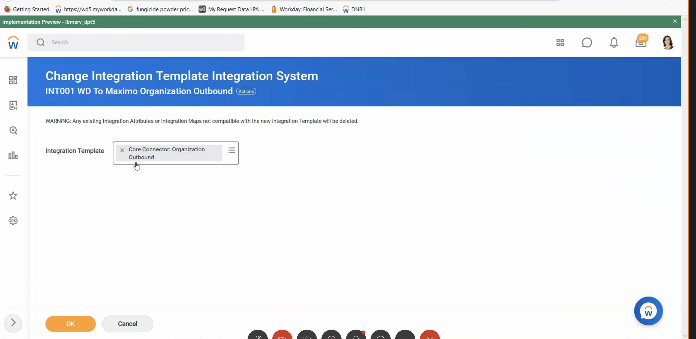 &nbsp;  
  - Background Process 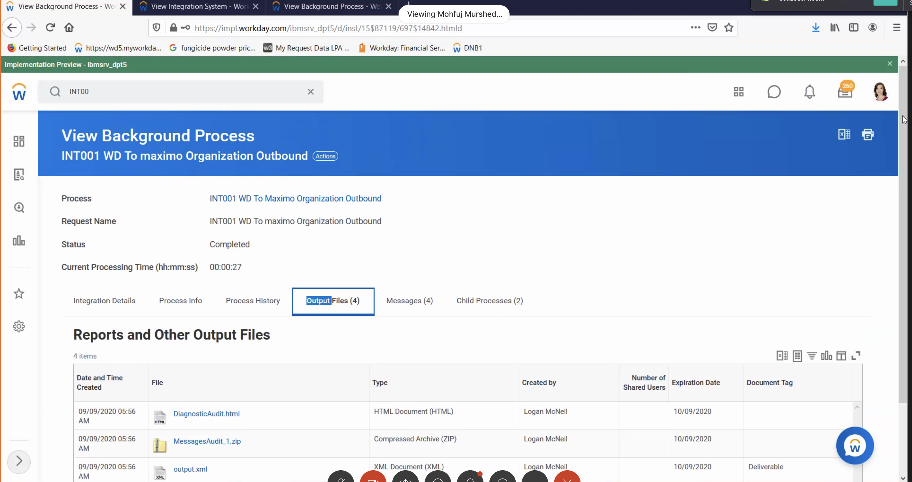 &nbsp;
  - Schedule 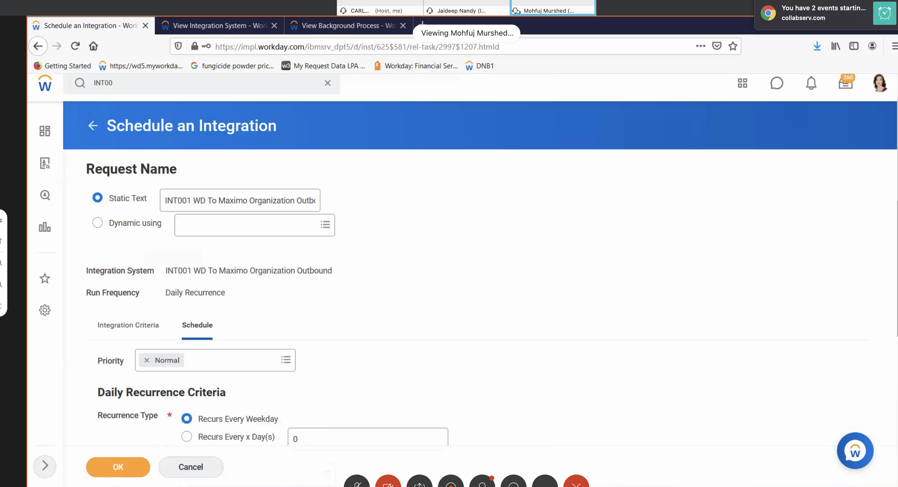 &nbsp;
  - Schedule Fields 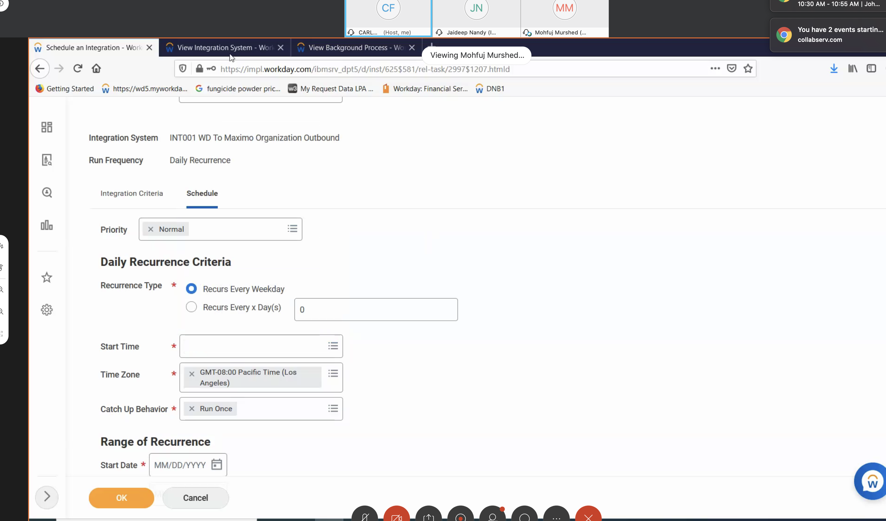 &nbsp; 
  - Schedule Frequency 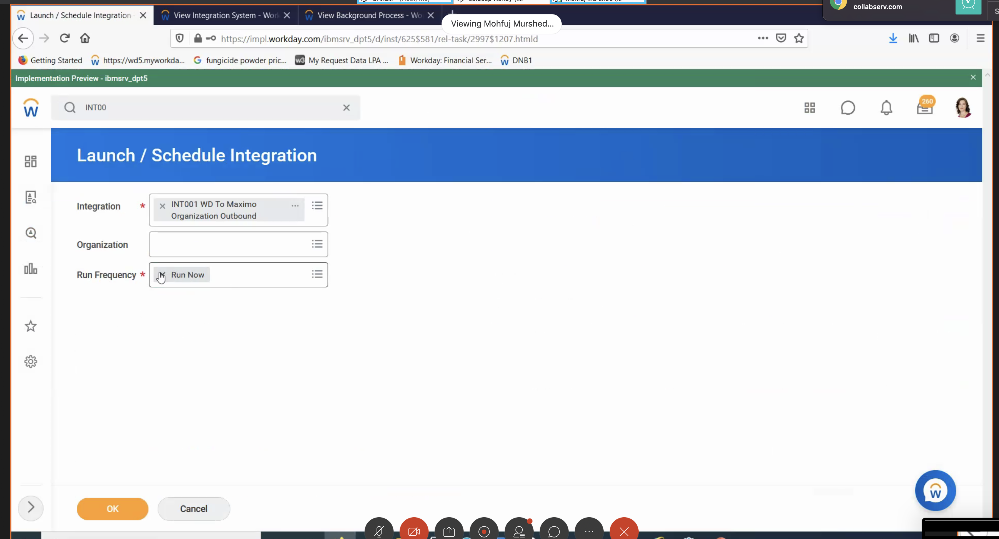 &nbsp;  
  - Schedule Frequency Attributes  &nbsp;  
  - Scope 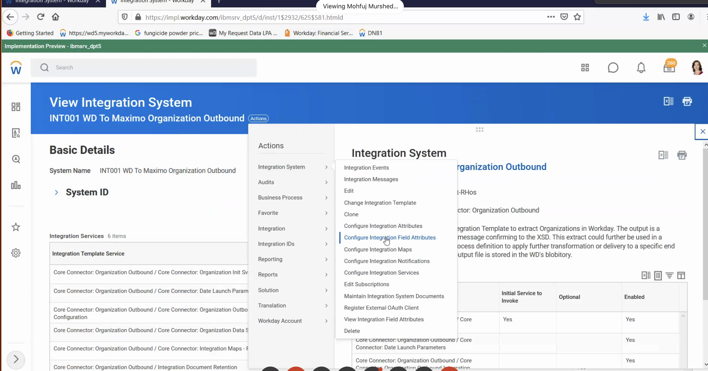 &nbsp;  
 
Configure Outbound Workday Integration Cloud for Organization
  - Launch the Workday Dashboard  choose `organization` to see the list of services.
  - Organization 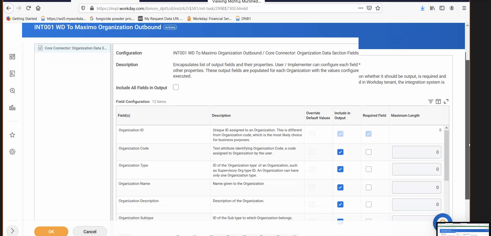 &nbsp;  
  - Organization Fields 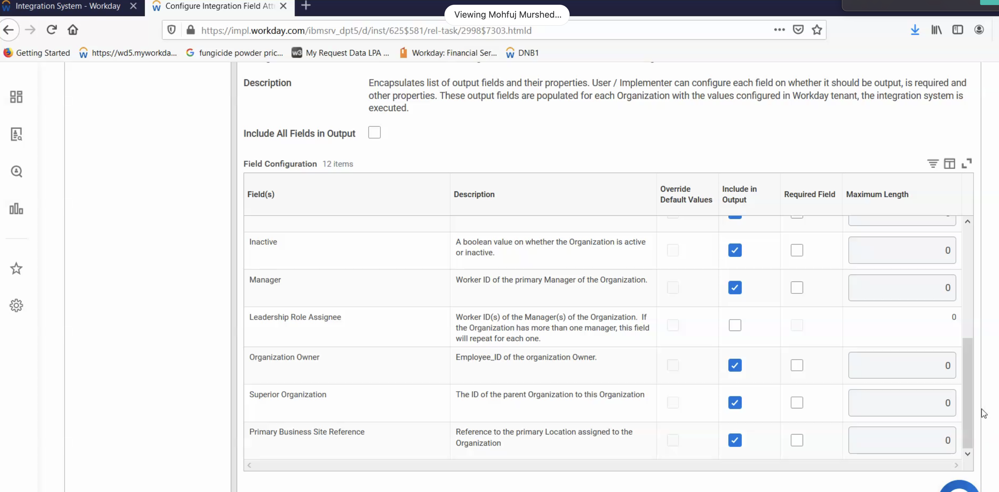 &nbsp; 
  - Example Organization.xml  &nbsp;  
  - See example organization.XML file  &nbsp; 
  
Configure Outbound Workday Integration Cloud for Worker
  - Launch the Workday Dashboard  choose `worker` to see the list of services.
  - Worker  &nbsp;  
  - Worker Fields  &nbsp;  
  - See example worker.XML  &nbsp; 
  
Configure Outbound Workday Integration Cloud for Location
  - Launch the Workday Dashboard  choose `location` to see the list of services.
  - Location Name 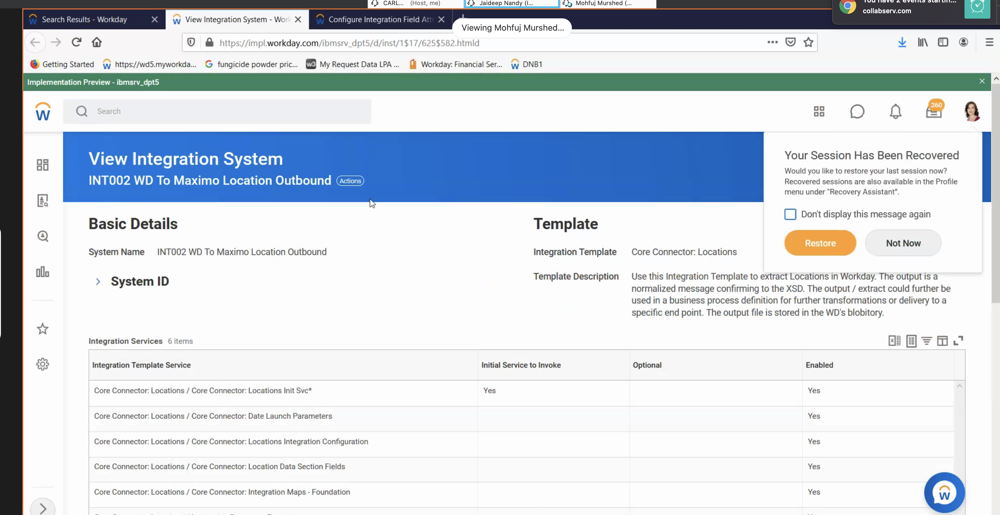 &nbsp;  
  - Location Description  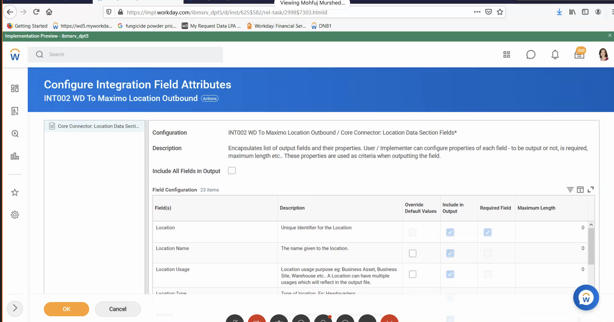 &nbsp;  
  - Location Fields 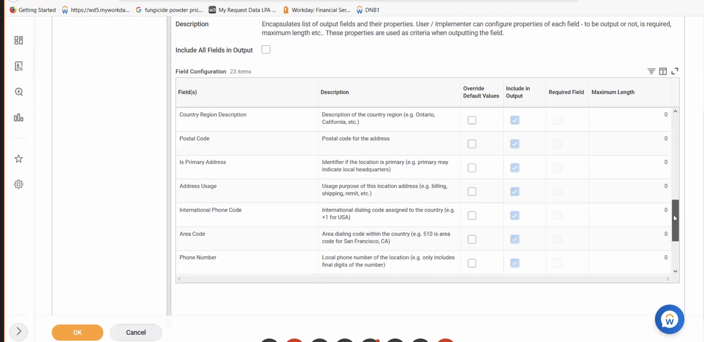 &nbsp;  
  - See example location.XML [location.xml](schemas/location.xml) &nbsp; 

View Events for Configure Outbound Workday Integration Cloud for Location
  - Events &nbsp;   

View Artifacts for Configure Outbound Workday Integration Cloud for Location
  - Artifcats  &nbsp;   
  
View XML for Configure Outbound Workday Integration Cloud for Location
  - Organization XML Sample  &nbsp;   
  

