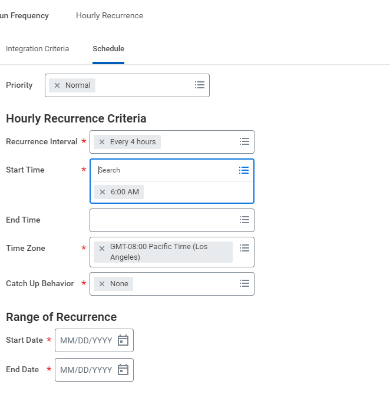

# Workday- Maximo Integration Configuration

## Steps

1. [Create Report Maximo Skills](#create-report-maximo-skills)
2. [Create Report Maximo Crafts](#create-report-maximo-crafts)
3. [Configure Scheduled Integration - Maximo Person Sync](#configure-scheduled-integration---maximo-person-sync)
4. [Launch & Schedule Integration](#launch--schedule-integration)

## For One Time Load

### Create report Maximo Skills

- Login into Workday Tenant.

- Security Required: Report Administrator, Report Writer

- Access task “Create Custom Report”

 

 

Filter on Category value will depend as per Configuration Workbook.

 

Report must be shared with Integration system Security  Group / Integration User.

 
 
 

 

 

 **REST API Endpoint:**

https://wd2-impl-services1.workday.com/ccx/service/customreport2/ibmsrv_dpt5/lmcneil/RPT_INT_Maximo_Skills?format=json

## Create report Maximo Crafts

- Login into Workday Tenant.

- Security Required: Report Administrator, Report Writer

- Access task “Create Custom Report”

 

 

Filter on Category value will depend as per Configuration Workbook.

 

Report must be shared with Integration system Security  Group / Integration User.

 
 
 

 

**REST Endpoint**

https://wd2-impl-services1.workday.com/ccx/service/customreport2/ibmsrv_dpt5/lmcneil/RPT_INT_Maximo_Crafts?format=json

 ## Configure Scheduled Integration - Maximo Person Sync

 ### Configure Core Connector Worker Integration template 

- Login into Workday Tenant.
- Security Required: Report Administrator, Report Writer, Integration Build
- Access task “Create Integration System”

**Importing Studio Integration**

[How to Download Studio](https://community.workday.com/studio-download)

- Download the clar file from : 
- Open Workday Studio
- Navigate to File > Import.
- From Wizard select Workday > CLAR file

Browse for the CLAR file from your local system

- Save the integration and Deploy to Workday Tenant.

#### Launch & Schedule Integration

